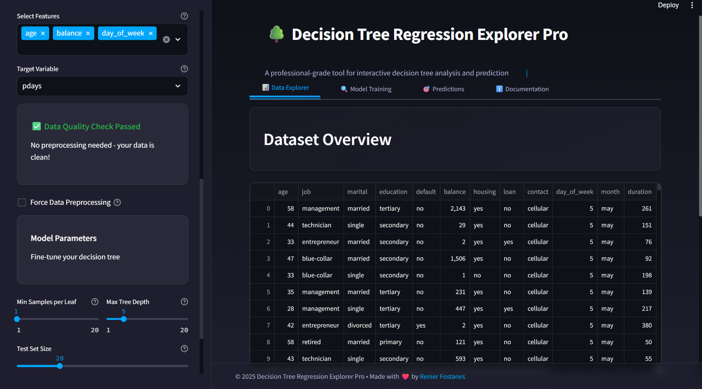
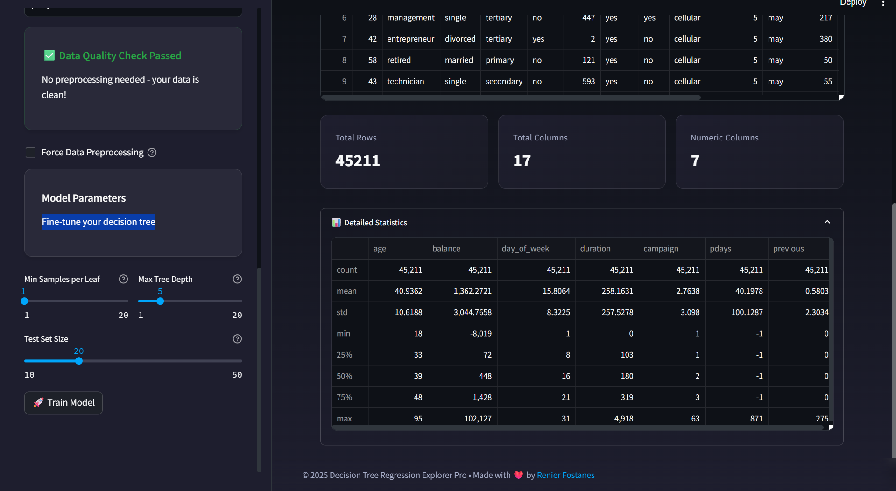
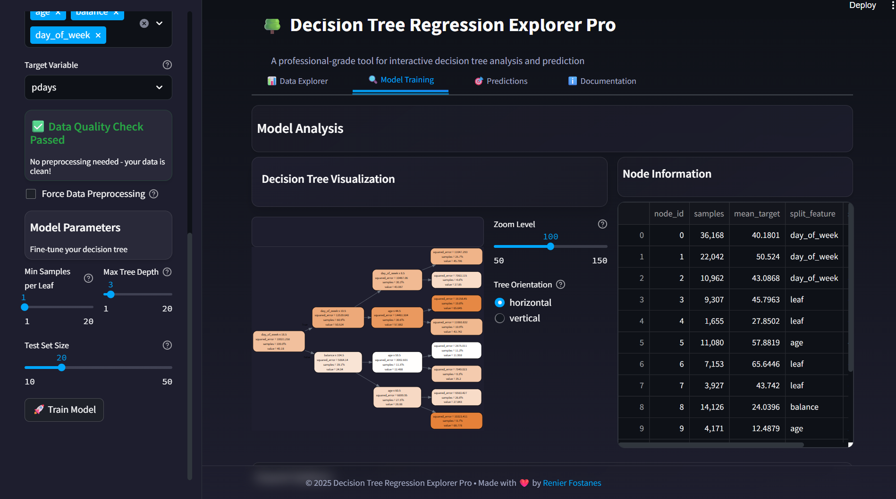
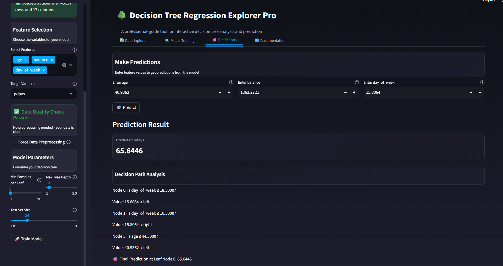

# Decision Tree Regression Explorer Pro

A professional-grade tool for interactive decision tree analysis and prediction, built with Streamlit and scikit-learn.

## Features

- 📊 Interactive data exploration and visualization
- 🌳 Advanced decision tree regression modeling
- 🎯 Real-time predictions with decision path analysis
- 🧹 Intelligent data preprocessing and cleaning
- 📈 Comprehensive model performance metrics
- 🎨 Modern, responsive UI with dark theme

## Screenshots

### Data Explorer


*Explore and analyze your dataset with interactive visualizations and statistics.*

### Model Training

*Train and visualize decision trees with customizable parameters and real-time performance metrics.*

### Predictions

*Make predictions and understand the decision path with detailed path analysis.*

## Installation

1. Clone the repository:
```bash
git clone https://github.com/mrfost07/Decision-Tree-Regression-Explorer-Pro.git
cd decision-tree-explorer
```

2. Create a virtual environment and activate it:
```bash
python -m venv venv
source venv/bin/activate  # On Windows: venv\Scripts\activate
```

3. Install dependencies:
```bash
pip install -r requirements.txt
```

## Usage

1. Start the application:
```bash
streamlit run app.py
```

2. Open your browser and navigate to the provided URL (typically http://localhost:8501)

3. Upload your dataset (CSV format) and start exploring!

## Features in Detail

### Data Exploration
- Interactive data preview
- Automatic data quality assessment
- Statistical summaries and visualizations
- Missing value detection

### Model Training
- Customizable tree parameters
- Real-time performance metrics
- Interactive tree visualization
- Model export capabilities

### Predictions
- Single-instance predictions
- Decision path analysis
- Confidence scores
- Batch prediction support

## Contributing

Contributions are welcome! Please feel free to submit a Pull Request.

## License

This project is licensed under the MIT License - see the LICENSE file for details.

## Acknowledgments

- Built with [Streamlit](https://streamlit.io/)
- Powered by [scikit-learn](https://scikit-learn.org/)
- UI components from [Streamlit Elements](https://github.com/okld/streamlit-elements)

## Author

Created by [Renier Fostanes](https://github.com/mrfost07)

---
© 2025 Decision Tree Regression Explorer Pro 